## 🚀 **Cloud DevOps CI/CD Pipeline Project**

A comprehensive, production-ready **DevOps CI/CD pipeline** built for cloud-native application deployment. This project demonstrates end-to-end automation from source code to Kubernetes deployment using modern DevOps tools and best practices.

### 🔧 **Tech Stack & Tools**
- **Infrastructure as Code:** Terraform (AWS + S3 Backend + CloudWatch)
- **Configuration Management:** Ansible (Roles + Dynamic Inventory)
- **Containerization:** Docker
- **Orchestration:** Kubernetes (K8s Deployment + Service)
- **CI/CD:** Jenkins (Pipeline as Code + Shared Libraries) + ArgoCD (GitOps)
- **Version Control:** GitHub
- **Monitoring:** AWS CloudWatch

### 📦 **Key Features**
- ✅ **Full IaC** – Automated AWS infrastructure provisioning
- ✅ **Containerized Microservices** – Docker-based application packaging
- ✅ **Kubernetes Orchestration** – Scalable and resilient deployments
- ✅ **Automated CI Pipeline** – Build, scan, push, and deploy images
- ✅ **GitOps Continuous Deployment** – ArgoCD for declarative K8s sync
- ✅ **Modular & Reusable Code** – Terraform modules, Ansible roles, Jenkins shared libraries
- ✅ **Comprehensive Documentation** – Setup guide and architecture overview

### 🎯 **Learning Outcomes**
This project showcases practical implementation of:
- Multi-tool DevOps pipeline integration
- Cloud infrastructure automation (AWS)
- Security scanning in CI
- GitOps-driven deployment strategies
- Production-like environment simulation


### Installation of Eksctl

`eksctl` is available to install from official releases as described below. We recommend that you install eksctl from only the official GitHub releases. You may opt to use a third-party installer, but please be advised that AWS does not maintain nor support these methods of installation. Use them at your own discretion.

#### For Unix
To download the latest release, run:

```bash
# for ARM systems, set ARCH to: `arm64`, `armv6` or `armv7`
ARCH=amd64
PLATFORM=$(uname -s)_$ARCH

curl -sLO "https://github.com/eksctl-io/eksctl/releases/latest/download/eksctl_$PLATFORM.tar.gz"

# (Optional) Verify checksum
curl -sL "https://github.com/eksctl-io/eksctl/releases/latest/download/eksctl_checksums.txt" | grep $PLATFORM | sha256sum --check

tar -xzf eksctl_$PLATFORM.tar.gz -C /tmp && rm eksctl_$PLATFORM.tar.gz

sudo install -m 0755 /tmp/eksctl /usr/local/bin && rm /tmp/eksctl
```


# Cloud DevOps Project - Final Project

## 📋 Project Overview
This project demonstrates a complete DevOps pipeline including:
- Infrastructure as Code with Terraform
- Configuration Management with Ansible
- Containerization with Docker
- Container Orchestration with Kubernetes
- CI/CD Pipeline with Jenkins
- GitOps Deployment with ArgoCD

## 🏗️ Architecture
[Architecture diagram will be added]

## 🚀 Quick Start
1. Clone the repository
2. Configure AWS credentials
3. Run Terraform to provision infrastructure
4. Run Ansible to configure servers
5. Deploy Jenkins pipeline
6. Configure ArgoCD for GitOps

## 📦 Prerequisites
- AWS Account with appropriate permissions
- GitHub Account
- Docker installed locally
- kubectl configured
- Terraform installed
- Ansible installed
- Jenkins server access
- ArgoCD installed

## 📁 Repository Structure
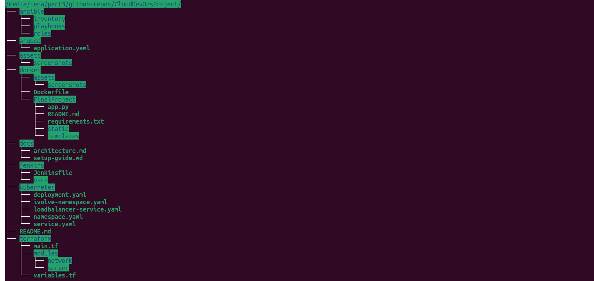


## ✅ Deliverables
- GitHub Repository URL: [text](https://github.com/RedaEssawy/CloudDevOpsProject.git)
- Complete CI/CD Pipeline
- Fully Automated Infrastructure
- GitOps-enabled Deployment

## 📞 Contact
For questions or support, please refer to the documentation or contact the DevOps team.

## Containerization with Docker:
## 🐳 Dockerfile
<pre>
FROM python:3.9-slim

# Set work directory
WORKDIR /app

# Set environment variables
ENV PYTHONDONTWRITEBYTECODE 1
ENV PYTHONUNBUFFERED 1
ENV FLASK_APP=app.py
ENV FLASK_ENV=production

# Install system dependencies
RUN apt-get update && apt-get install -y --no-install-recommends \
    gcc \
    && apt-get clean \
    && rm -rf /var/lib/apt/lists/*  


# Copy requirements
COPY FinalProject/requirements.txt .

# Install python dependencies
RUN pip install --no-cache-dir -r requirements.txt

# Copy application code 
COPY FinalProject/app.py .
COPY FinalProject/static/ ./static/
COPY FinalProject/templates/ ./templates/

# Create non-root user 
RUN addgroup --system appgroup && adduser --system --ingroup appgroup appuser && chown -R appuser:appgroup /app

# Switch to non-root user
USER appuser


# Expose the port
EXPOSE 5000

# Helth check
HEALTHCHECK --interval=30s --timeout=3s CMD curl -f http://localhost:5000/ || exit 1

# Run the application
CMD ["gunicorn", "--bind", "0.0.0.0:5000", "app:app"]
</pre>

## Build Docker Image From the Dockerfile
Run the following command the the docker directory that has Dockerfile file.
```bash
docker build -t redaeid/ivolvefinalproject:v1 .
```
Expected output
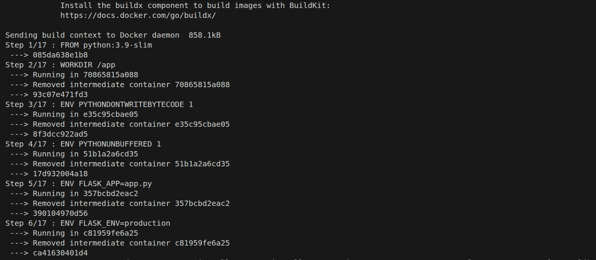
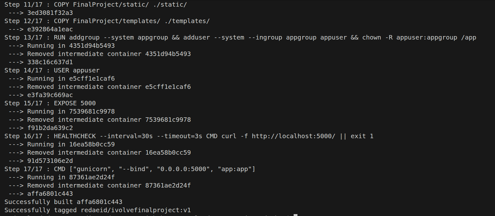

## Test the image locally
Run test-locally container from the image
```bash
 docker run --name test-locally -d -p 5000:5000 redaeid/ivolvefinalproject:v1
 ```
```bash
docker logs test-locally 
```
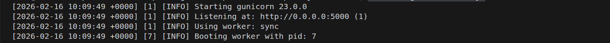

Expected output on the browser
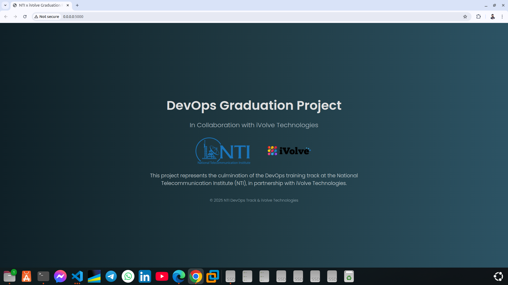

## Push the image into dockerhub
```bash 
docker push redaeid/ivolvefinalproject:v1 
```
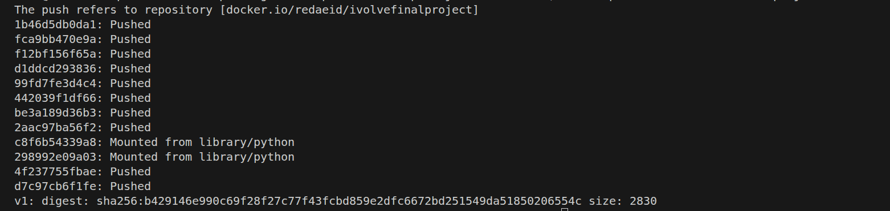

# Container Orchestration with kubernetes:
## ☸️ Kubernetes Manifests

### STEP 1 — Setup Kubernetes.
### Install minikube

```bash
sudo apt install minikube
```
### Start minikube

```bash
minikube start
```
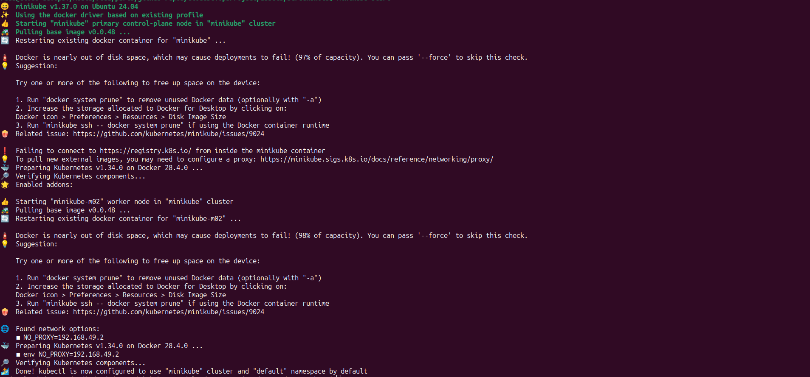

### STEP 2 — Create Namespace.
```bash
touch namespace.yaml
```
<pre>
apiVersion: v1
kind: Namespace
metadata:
  name: ivolve
  labels:
    name: ivolve
    environment: productionaa0daa0d90d4aa0d90d4aa0d90d4aa0d90d4aa0d90d490d4
    managed-by: devops
spec: {}aa0d90d4aa0d90d4
status: {}
</pre>

### STEP 3 — Create Deployment YAML.
```bash 
touch deployment.yaml
```
<pre>

apiVersion: apps/v1
kind: Deployment
metadata:
  name: flask-app
  namespace: ivolve
spec:
  replicas: 2
  selector:
    matchLabels:
      app: flask-app
  template:
    metadata:
      labels:
        app: flask-app
    spec:
      containers:
        - name: flask-container
          image: redaeid/ivolvefinalproject:v1
          ports:
            - containerPort: 5000
</pre>

### STEP 4 — Create Service YAML.
```bash
touch service.yaml
```
<pre>
apiVersion: v1
kind: Service
metadata:
  name: flask-service
  namespace: ivolve
spec:
  type: NodePort
  selector:
    app: flask-app
  ports:
    - port: 5000
      targetPort: 5000
      nodePort: 30007
</pre>

### STEP 5 — Apply YAML.
```bash
kubectl apply -f namespace.yaml
kubectl apply -f deployment.yaml
kubectl apply -f service.yaml
```
Expected output:
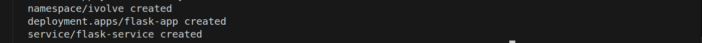

### STEP 6 — Access Application.

Using `minikube`.
```bash
minikube service flask-service -n ivolve
```
Expected output.
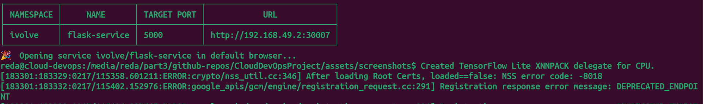

Open:
<pre>
http://<minikube-ip>:30007
</pre>
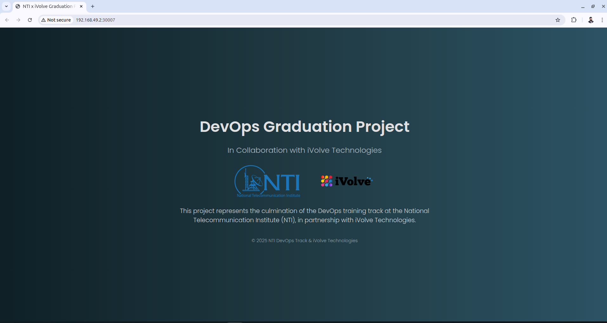

### STEP 7 — Scaling Test.

```bash
kubectl scale deployment flask-app --replicas=3 -n ivolve
kubectl get pods -n ivolve
```
Expected output:
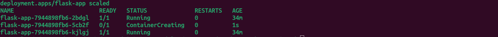

# Terraform (AWS Infrastructure).

### STEP 1 — Install Terraform.

Check if `terraform` installed:
```bash
terraform version
```
The output should be similar to:
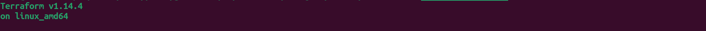

If not installed run the following command to install:
```bash
sudo snap install terraform --classic
```

### STEP 2 — AWS Credentials.

Install `awscli`.
```bash
sudo apt install awscli
```

Configure AWS credentials:
```bash
aws configure
```
You will be asked to enter the values as shown bellow:
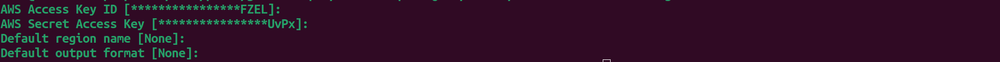

### STEP 3 — Folder Structure.
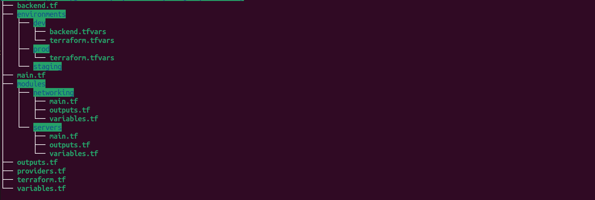

