#  Cloud DevOps CI/CD Pipeline Project

A comprehensive, production-ready Cloud DevOps CI/CD pipeline built for cloud-native application deployment on AWS.

This project simulates a real-world enterprise DevOps environment where infrastructure provisioning, CI, and CD are fully automated using cloud-native tools.

---

# 🛠 Tech Stack

- Infrastructure as Code: Terraform (AWS + S3 Backend + CloudWatch)
- Configuration Management: Ansible (Roles + Dynamic Inventory)
- Containerization: Docker
- Orchestration: Kubernetes (Minikube)
- Continuous Integration: Jenkins (Pipeline as Code + Shared Libraries)
- Continuous Deployment: ArgoCD (GitOps)
- Version Control: GitHub

---

#  Implementation Journey

The project was implemented in the following order:

1. Containerization with Docker  
2. Container Orchestration with Kubernetes  
3. Infrastructure Provisioning using Terraform  
4. Configuration Management using Ansible  
5. Continuous Integration using Jenkins  
6. Continuous Deployment using ArgoCD  

---
#  Architecture Diagram
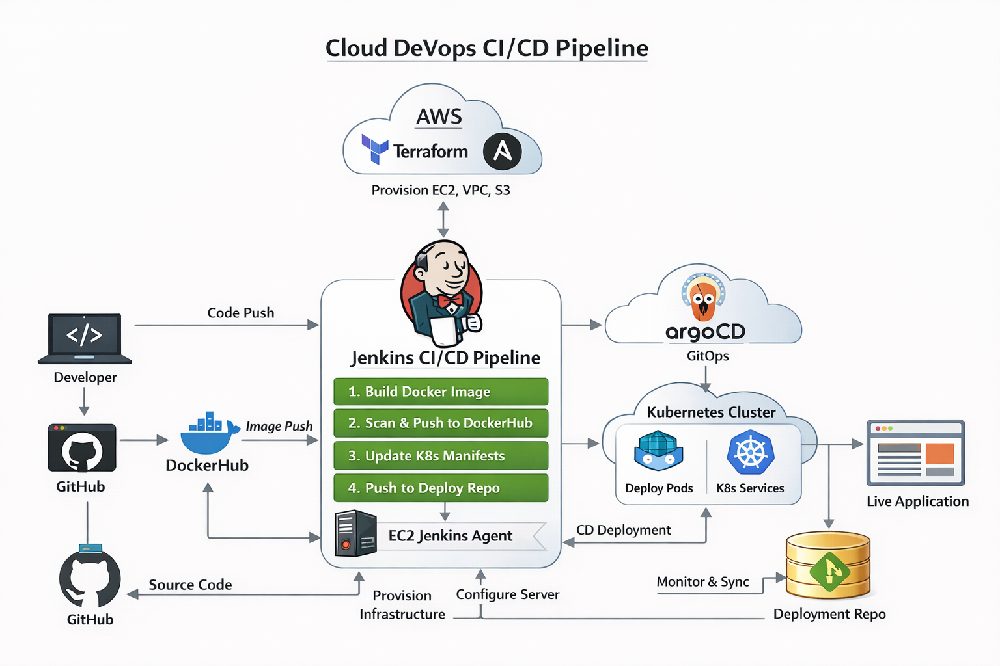


#  Phase 1 — Containerization with Docker

## Dockerfile

```dockerfile
FROM python:3.9-slim

WORKDIR /app

ENV PYTHONDONTWRITEBYTECODE 1
ENV PYTHONUNBUFFERED 1
ENV FLASK_APP=app.py
ENV FLASK_ENV=production

RUN apt-get update && apt-get install -y --no-install-recommends \
    gcc curl \
    && apt-get clean \
    && rm -rf /var/lib/apt/lists/*  

COPY FinalProject/requirements.txt .
RUN pip install --no-cache-dir -r requirements.txt

COPY FinalProject/app.py .
COPY FinalProject/static/ ./static/
COPY FinalProject/templates/ ./templates/

RUN addgroup --system appgroup && \
    adduser --system --ingroup appgroup appuser && \
    chown -R appuser:appgroup /app

USER appuser

EXPOSE 5000

HEALTHCHECK --interval=30s --timeout=3s CMD curl -f http://localhost:5000/ || exit 1

CMD ["gunicorn", "--bind", "0.0.0.0:5000", "app:app"]
```

---

## Build Docker Image

```bash
docker build -t redaeid/ivolvefinalproject:v1 .
```


---

## Test Image Locally

```bash
docker run --name test-locally -d -p 5000:5000 redaeid/ivolvefinalproject:v1
docker logs test-locally
```


---

## Push to DockerHub

```bash
docker push redaeid/ivolvefinalproject:v1
```


---

# ☸ Phase 2 — Kubernetes (Minikube)

## Start Minikube

```bash
minikube start
```


---

## Apply Manifests

```bash
kubectl apply -f namespace.yaml
kubectl apply -f deployment.yaml
kubectl apply -f service.yaml
```


---

## Access Application

```bash
minikube service flask-service -n ivolve
```


---

## Scaling Test

```bash
kubectl scale deployment flask-app --replicas=3 -n ivolve
kubectl get pods -n ivolve
```


---

#  Phase 3 — Terraform (AWS Infrastructure)

## Check Terraform Version

```bash
terraform version
```


---

## Configure AWS

```bash
aws configure
```


---

## Initialize Terraform

```bash
terraform init
```

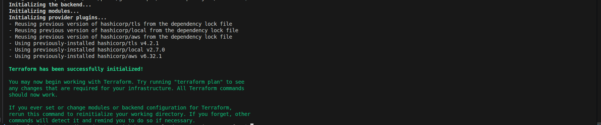

---

## Plan & Apply

```bash
terraform plan
terraform apply -auto-approve
```

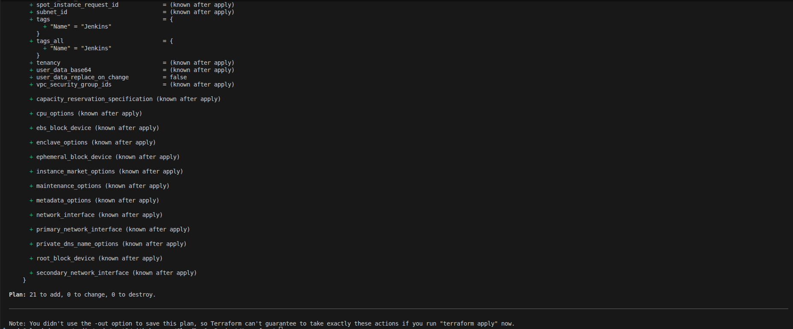
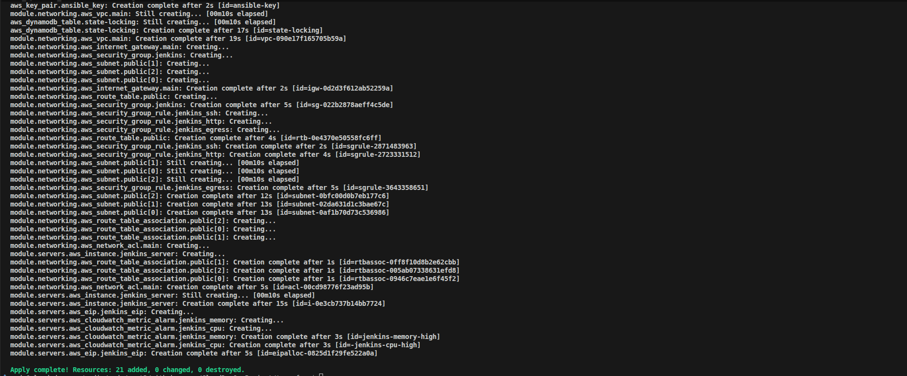

---

## Created AWS Resources

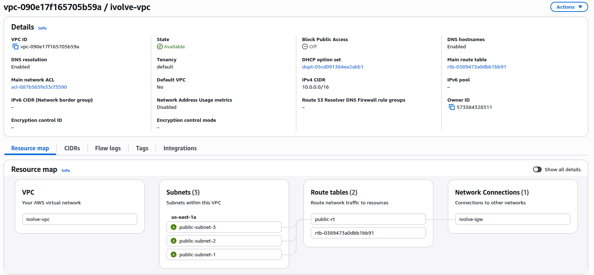
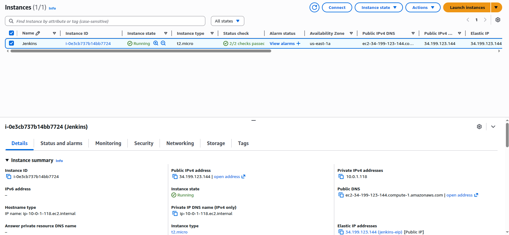

---

#  Phase 4 — Configuration Management (Ansible)

Configured EC2 as Jenkins Agent using Ansible.

```bash
ansible-playbook -i inventory/aws_ec2.yml playbooks/playbook1 \
--user ubuntu \
--private-key /home/reda/.ssh/ansible-key.pem \
--ssh-extra-args "-o StrictHostKeyChecking=accept-new"
```

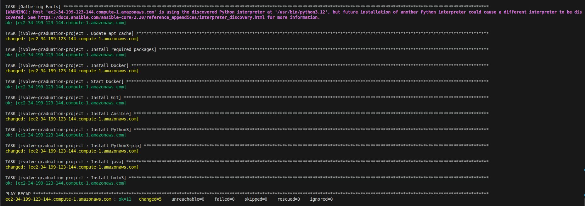

---

# Phase 5 — Continuous Integration (Jenkins)

## Install Jenkins

```bash
sudo apt install fontconfig openjdk-21-jre
sudo apt install jenkins
```

Start Jenkins:

```bash
sudo systemctl enable jenkins
sudo systemctl start jenkins
sudo systemctl status jenkins
```

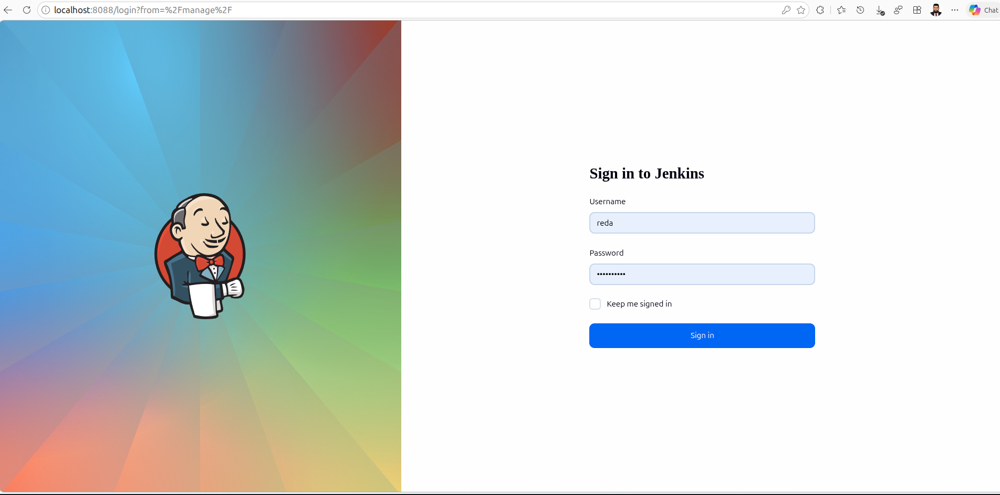

Create an Agent Using the EC2

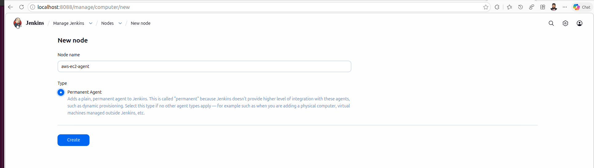
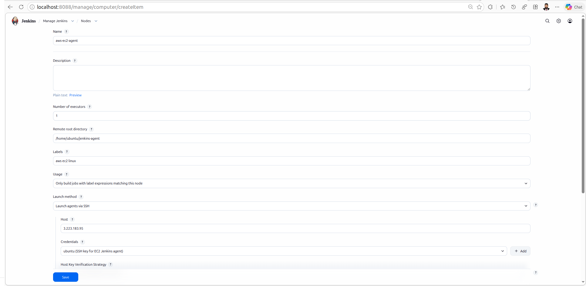
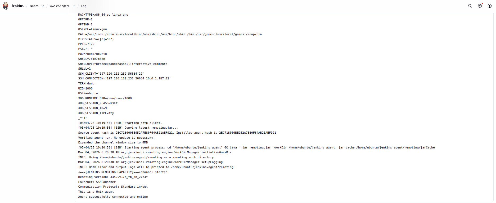

Then use This Agent in Jenkinsfile as an Agent


---

## Pipeline Stages

1. Clone Source Code  
2. Build Docker Image  
3. Scan Docker Image  
4. Push Image  
5. Update Kubernetes Manifests  
6. Push to Deployment Repo  

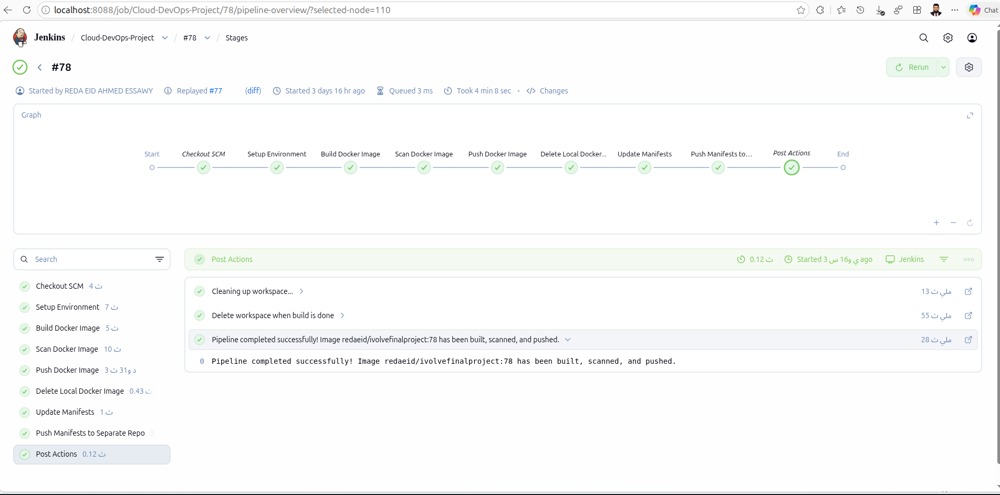

---

#  Phase 6 — Continuous Deployment (ArgoCD)

## Install ArgoCD

```bash
kubectl create namespace argocd
kubectl apply -n argocd -f https://raw.githubusercontent.com/argoproj/argo-cd/stable/manifests/install.yaml
```

Forward Port:

```bash
kubectl port-forward svc/argocd-server -n argocd 8089:443
```

Get Initial Password:

```bash
kubectl -n argocd get secret argocd-initial-admin-secret -o jsonpath="{.data.password}" | base64 -d
```

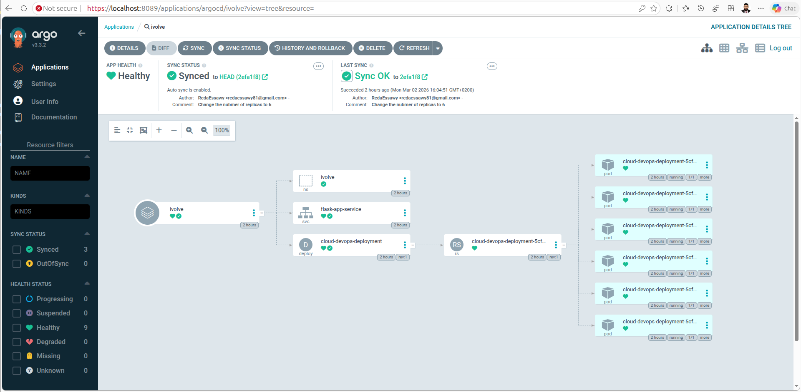

---

#  Author

Reda Essawy  
Cloud & DevOps Engineer  
GitHub: https://github.com/RedaEssawy

---
